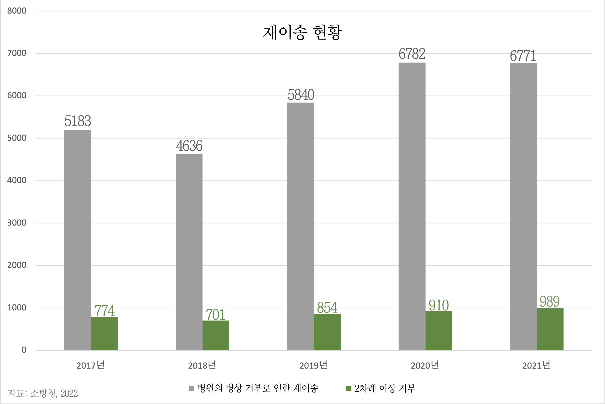
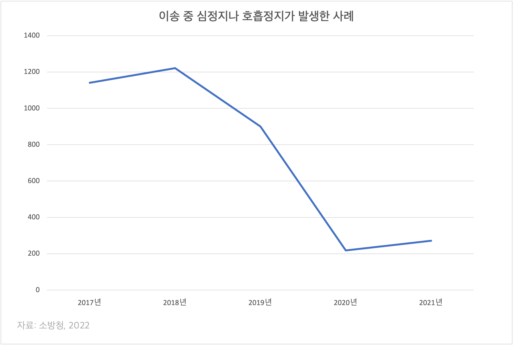

❗️ GIF 파일을 로딩하는 데에 시간이 걸리므로, 조금만 기다려주시길 바랍니다.

# 🚑 **C-ITS 응급환자이송지원시스템**
## 소개
- C-ITS는 응급구조차량이 출동 장소에서 이송 장소로 **효율적**으로 움직일 수 있게 도와주는 시스템입니다.
- 기존의 시스템과의 차별점:   병원 내 병상 수, 해당 환자를 맡을 수 있는 전문의의 여부를 파악하여 적절한 병원 목록을 파악하고 **최단 경로를 찾아주는 것**이 핵심입니다.
  
📑 [사용법](directions.md) 요약:
  1.환자 나이 선택
  2.증상 키워드 입력
  3.응급 상황 정보 선택
  4."적합한 병원 경로 확인하기" 또는 사이드바의 "병원 최단 경로 도출" 탭 클릭
  5.현 주소 입력 **(도로명 주소 입력)**
  6.현 위치에서 가장 가까운 병원 확인

## 프로젝트 기획까지
기존 C-ITS는 출동 장소의 보조 역할만 할 뿐 적합한 이송 장소를 찾아주지는 않습니다.  
23년 3월, 10대 여학생이 응급실을 찾아 떠돌다 구급차에서 숨진 것과 관련해 의료 기관들이 중증도 분류도 하지 않은 채 **환자 수용을 거부한 것으로 확인된 사건**이 있었습니다.   이와 더불어, 22년 7월까지 병원들이 **병상을 거부하여 환자들을 재이송하는 경우**가 3505건 발생하였으며, 이 중 198건은 환자가 재이송 중 심정지 또는 호흡정지로 사망한 것으로 확인되었습니다.

위의 표는 2017년부터 5년 간 병원의 병상 거부로 인한 재이송 현황을 나타낸 표입니다. 거부 이유는 **전문의 부재** 1105건, **병상 부족** 789건이 대다수였습니다.

구급차 출동부터 현장 도착 시간은 **20분 이내**가 대다수(22.5%)로, 30분 초과는 2% 밖에 되지 않았지만 병원 도착 시간은 **60분 이내**가 39.7%로 가장 많았습니다.

119 구급차가 환자를 이송하지만 병원의 거부로 다른 병원으로 이동하는 도중에 심정지나 호흡 정지가 발생한 사례는 과거에 비해 줄어들었지만 여전히 수백 건에 달하는 양입니다.

이러한 사건들로 병원 전 중증도 분류 도입의 시급함이 강조되었습니다.   이를 바탕으로 더 이상의 응급 환자 거부를 방지하기 위해 C-ITS 응급환자이송지원시스템을 고안하게 되었습니다.
> 출처: [응급환자 거부 병원들…구급차 뺑뺑이 ‘198명’ 사망. (2022).](https://www.dailymedi.com/news/news_view.php?ca_id=2201&wr_id=889836).

## 프로젝트 설명
본 프로젝트는 networkx를 이용해 만들어진 증상과 진료과 간의 그래프를 통해 환자에 적합한 진료과를 탐색합니다. 그리고 **해당 진료과가 있는 병원 중 가장 가까운 거리에 있는 3개의 병원에 대한 최단 경로를 표시합니다.**

## License
This software is under the MIT License.
